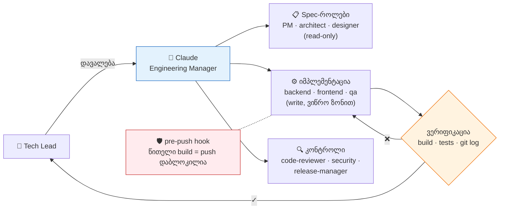

# create-claude-team

Claude Code AI team config — ერთი ბრძანებით ნებისმიერ პროექტში.

ერთ `.claude/` setup-ში იღებ სრულ AI dev team-ს: 9 სპეციალისტი agent, რომელთაც
Claude ორკესტრირებს როგორც Engineering Manager, + auto-apply წესები, skills,
git hooks და slash commands — შენი stack-ზე მორგებული.



📚 **დეტალური დოკუმენტაცია:** [პროექტის სრული აღწერა](docs/project-overview.md) ·
[`.claude/` კონფიგურაციის გზამკვლევი](docs/claude-config-guide.md)

## გამოყენება

### ვარიანტი A — npm-დან (გამოქვეყნების შემდეგ)
```bash
cd your-project
npx create-claude-team
```

### ვარიანტი B — ლოკალურად (გამოქვეყნებამდე)
```bash
cd your-project
node /path/to/create-claude-team/bin/create.mjs
```

CLI დასვამს 7 კითხვას (~2 წუთი), შემდეგ:
- დააკოპირებს `.claude/` agents, rules, compositions, skills, hooks, commands
- შეავსებს `CLAUDE.md`-ს შენი stack-ის და project name-ის მიხედვით
- `/check`-ს და pre-push hook-ს მოარგებს build/test command-ებს
- `.gitignore`-ს დაუმატებს `CLAUDE.md` და `.claude/` — **repo-ში არ შეიტანება**

ინსტალაციის შემდეგ გახსენი Claude Code პროექტში და გაუშვი `/setup-team` —
დარჩენილ დეტალებს ინტერაქტიულად დააზუსტებს.

---

## რას მიიღებ

### Agents — სპეციალისტთა team
Claude მუშაობს Engineering Manager-ად: ასაქმებს agent-ებს და **ამოწმებს** მათ
შედეგს, სანამ მოგახსენებს.

| Agent | როდის |
|-------|-------|
| `product-manager` | feature scoping, spec, ticket breakdown |
| `architect` | system design, data model, API contracts |
| `backend-engineer` | backend implementation |
| `frontend-engineer` | frontend implementation |
| `designer` | UI/UX specs, design tokens |
| `qa-tester` | integration / e2e tests |
| `code-reviewer` | post-change audit (read-only) |
| `security-reviewer` | pre-release security pass (read-only) |
| `release-manager` | CHANGELOG, version bump, runbook |

### Rules — auto-apply ქცევა
ავტომატურად ირთვება, გამოძახების გარეშე ( `.claude/rules/` ):
- **`read-context`** — კოდის წერამდე CLAUDE.md + არსებული pattern-ების წაკითხვა
- **`plan-to-docs`** — დამტკიცებული გეგმის `docs/decisions/`-ში შენახვა
- **`self-improve`** — compounding loop: გამეორებული შეცდომა → ახალი წესი

### Skills + Commands
- **`pre-flight`** — კოდამდე checklist (assumptions, simplicity, surgical scope)
- **`docs-edit`** — markdown დოკუმენტაციის წესები
- **`/new-ticket "<ask>"`** — შემდეგი ticket სტანდარტული template-ით
- **`/check`** — build + tests, ასწორებს და loop-ავს სანამ green გახდება

### Compositions — multi-role workflow-ები
- **`new-feature`** — სრული vertical slice: spec → design → backend → frontend → tests → review

### Hooks — git push-ის gate-ები
- **`pre-push-verify.mjs`** — push-ს ბლოკავს build/typecheck/lint-ის ჩავარდნაზე
- **`check-uncommitted.mjs`** — სესიის ბოლოს გაფრთხილება uncommitted ცვლილებებზე

---

## npm-ზე ატვირთვა

```bash
cd create-claude-team
npm login
npm publish
```

შემდეგ ნებისმიერ კომპიუტერზე:
```bash
npx create-claude-team
```

---

## სტრუქტურა

```
template/
├── CLAUDE.md                    # main project instructions
└── .claude/
    ├── settings.json            # permissions + hooks config
    ├── agents/
    │   ├── architect.md
    │   ├── backend-engineer.md
    │   ├── frontend-engineer.md
    │   ├── designer.md
    │   ├── qa-tester.md
    │   ├── product-manager.md
    │   ├── code-reviewer.md
    │   ├── security-reviewer.md
    │   └── release-manager.md
    ├── skills/
    │   ├── pre-flight/          # coding pre-checklist
    │   ├── docs-edit/           # doc editing conventions
    │   └── setup-team/          # interactive wizard (for Claude)
    ├── rules/                   # auto-apply behavioral triggers
    │   ├── read-context.md      # read before coding
    │   ├── plan-to-docs.md      # persist approved plans
    │   └── self-improve.md      # compounding feedback loop
    ├── compositions/            # multi-role workflows
    │   └── new-feature.md       # full vertical slice
    ├── hooks/
    │   ├── pre-push-verify.mjs  # gates git push on build
    │   └── check-uncommitted.mjs
    └── commands/
        ├── new-ticket.md        # /new-ticket slash command
        └── check.md             # /check — build + verify
```
