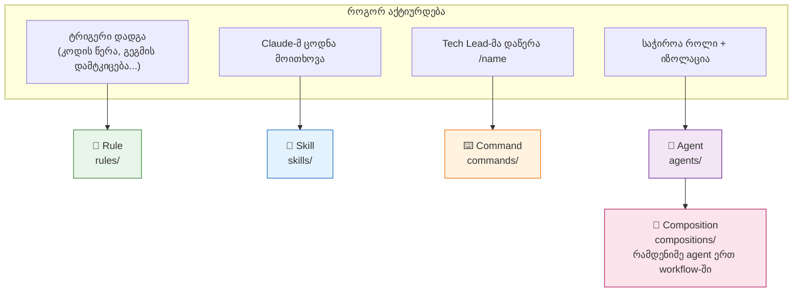
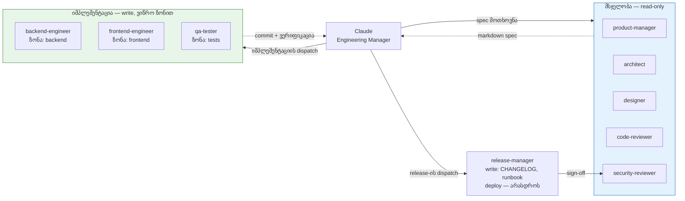
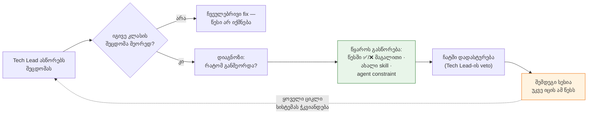
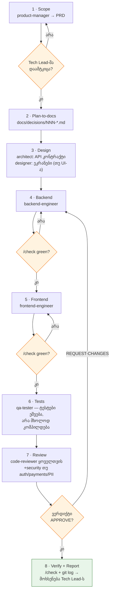
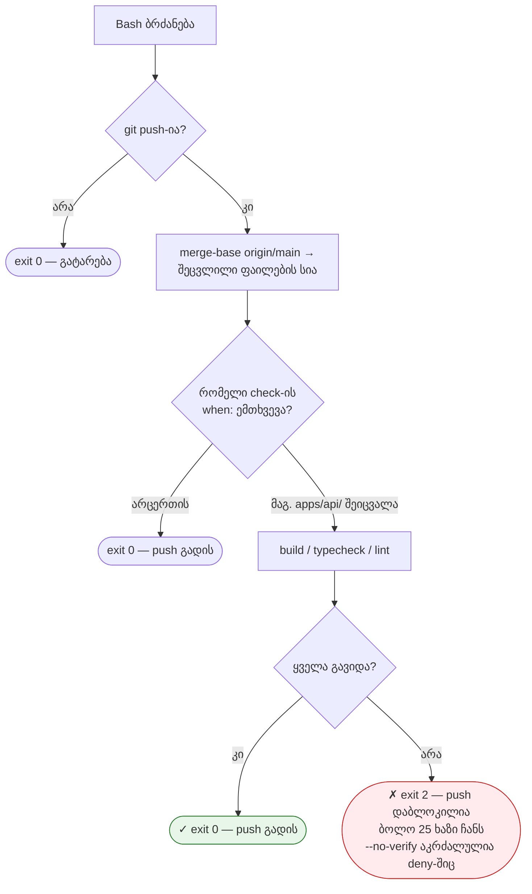

# `.claude/` კონფიგურაცია — დეტალური გზამკვლევი

**თარიღი:** 2026-06-10

ეს დოკუმენტი აღწერს `template/.claude/`-ის ყველა კომპონენტს: რა არის, რისთვისაა,
რატომ არის ისე აგებული, როგორც არის — და რა შეუძლია დაამატოს მომხმარებელმა
საკუთარ პროექტში. ზოგადი მიმოხილვისთვის იხილეთ
[project-overview.md](project-overview.md).

## არქიტექტურის ლოგიკა — ოთხი ფენა

კონფიგურაცია ოთხ ფენად იყოფა და თითოეული სხვანაირად აქტიურდება:

| ფენა | როგორ ირთვება | რისთვისაა |
|------|---------------|-----------|
| **Rule** (`rules/`) | ავტომატურად, ტრიგერის დადგომისას | ქცევა, რომელიც ყოველთვის უნდა სრულდებოდეს |
| **Skill** (`skills/`) | Claude თავად იძახებს (`Skill: pre-flight`) | ერთი დისციპლინა — checklist, კონვენციების ნაკრები |
| **Command** (`commands/`) | Tech Lead-ი წერს `/name`-ს | ადამიანის მიერ ინიცირებული მოქმედება |
| **Agent** (`agents/`) | Claude აგზავნის (dispatch) როლისთვის | იზოლირებული კონტექსტი + შეზღუდული უფლებები |

წესი: რაც ყოველთვის უნდა მოხდეს → rule; რაც ცოდნაა და არა როლი → skill; რასაც
ადამიანი იწყებს → command; რასაც ცალკე კონტექსტი და უფლებების იზოლაცია სჭირდება
→ agent. Compositions (`compositions/`) მეხუთე შრეა — რამდენიმე agent-ის
თანმიმდევრობა ერთი workflow-ით.

---

## Agents — 9 როლი დეტალურად

ყველა agent არის markdown ფაილი YAML frontmatter-ით: `name`, `description`
(Claude ამით წყვეტს, როდის გამოიყენოს), `model` (sonnet — იმპლემენტაცია,
opus — ღრმა მსჯელობა) და `tools` (უფლებების საზღვარი).

### დიზაინის ორი პრინციპი

1. **Read-only და write agent-ები გამიჯნულია.** მსჯელობის როლებს (architect,
   PM, designer, reviewer-ები) ფაილის ჩაწერის უფლება არ აქვთ — სპეციფიკაციას
   აბრუნებენ, კოდს არა. ეს გამორიცხავს „reviewer-მა თვითონ გაასწორა და
   ვერავინ შეამოწმა" სცენარს.
2. **Write agent-ებს ვიწრო ზონა აქვთ.** backend-engineer მხოლოდ backend
   ფაილებს ეხება, frontend-engineer — მხოლოდ frontend-ს, qa-tester — მხოლოდ
   ტესტებს. საზღვრის დარღვევა აღმოჩენადია review-ზე.

### მსჯელობის როლები (read-only)

| Agent | Model | რას აბრუნებს | რატომ ცალკე როლი |
|-------|-------|--------------|------------------|
| `product-manager` | sonnet | PRD: პრობლემა, user stories, acceptance criteria, out-of-scope, ticket-ები (თითო ≤1 engineer-day) | ბიზნეს-მოთხოვნის სტრუქტურირება იმპლემენტაციის ფიქრამდე; scope creep-ის ბლოკი (≤800 სიტყვა) |
| `architect` | opus | სპეციფიკაცია: affected files, entity/API სკელეტები, security implications, ≥2 ალტერნატივა trade-off-ებით, რისკები, ტესტ-სტრატეგია | მონაცემთა მოდელისა და API კონტრაქტის გადაწყვეტა კოდამდე ბევრად იაფია, ვიდრე კოდის შემდეგ |
| `designer` | sonnet | ეკრანის სპეციფიკაცია: layout (desktop+mobile), კომპონენტები, ყველა state (loading/empty/error), copy-ready ტექსტები, accessibility | UI-ის ყველა მდგომარეობის წინასწარ აღწერა; Figma MCP-ით დიზაინის წყაროს კითხვაც შეუძლია |

### იმპლემენტაციის როლები (write, ვიწრო ზონით)

| Agent | Model | ზონა | მთავარი წესები |
|-------|-------|------|----------------|
| `backend-engineer` | sonnet | მხოლოდ backend | სავალდებულო pre-flight gate 30+ ხაზზე; input ვალიდაცია controller-ზე; მხოლოდ ORM/პარამეტრიზებული query; secrets მხოლოდ env-დან; build-ვერიფიკაცია „done"-მდე. `## Stack` სექციას CLI ავსებს არჩეული stack-ით |
| `frontend-engineer` | sonnet | მხოლოდ frontend | მხოლოდ design tokens (raw hex აკრძალულია); ყველა string i18n-ით; PII არასდროს `localStorage`-ში; `dangerouslySetInnerHTML` sanitization-ის გარეშე აკრძალულია |
| `qa-tester` | sonnet | მხოლოდ ტესტ-დირექტორიები | „red first" — ბაგი ჯერ ჩავარდნილი ტესტით რეპროდუცირდება; ერთი assertion ერთ ტესტში; აპლიკაციის ბაგს **არ ასწორებს** — აბრუნებს report-ად (ეს backend-engineer-ის საქმეა); ტესტი უნდა გაეშვას, არა მხოლოდ დაკომპილდეს |

### კონტროლის როლები

| Agent | Model | რას აკეთებს | რატომ |
|-------|-------|-------------|-------|
| `code-reviewer` | sonnet | merge-base diff-ის აუდიტი 5 ჭრილში: security → correctness → karpathy-compliance → ტესტ-დაფარვა → style. ვერდიქტი: APPROVE / APPROVE-WITH-FIXES / REQUEST-CHANGES, ფინდინგები Critical/Major/Minor/Nit დონეებით | Read-only — ასწორებს კი არა, აფასებს. Style bikeshedding-ზე ბლოკი ეკრძალება |
| `security-reviewer` | opus | release-ის წინა ვიწრო, ღრმა pass: auth, RBAC, PII ლოგებში, secret-ების სკანი, injection, transport headers, Stripe/OAuth/webhook წესები | code-reviewer ხარისხს ამოწმებს ყოველ commit-ზე; ეს — release-ბლოკერ საფრთხეებს. თეორიული შეტევებით padding ეკრძალება — მხოლოდ კონკრეტული ვექტორი |
| `release-manager` | opus | diff-ანალიზი ბოლო tag-დან, semver-ის შეთავაზება, CHANGELOG (Keep-a-Changelog), security-reviewer-ის dispatch, deploy runbook rollback-პროცედურით | **არასდროს deploy-ს თვითონ** — git tag-საც კი მხოლოდ სთავაზობს. ერთადერთი agent-ი `Agent` tool-ით (სხვა agent-ის გამოძახება შეუძლია) |

---

## Skills — სამი დისციპლინა

### `pre-flight` — კოდისწინა gate

ხუთსაფეხურიანი checklist, რომელსაც ინჟინერი agent-ები **ვალდებულნი** არიან
ჩაატარონ 30+ ხაზის, ახალი ფაილის ან refactor-ის წინ და შედეგი ჩატში დაპოსტონ:

1. **დაშვებები** — 2–4 ვარაუდი მოთხოვნაზე; ორაზროვნება = კითხვა Tech Lead-ს
2. **სიმარტივის ტესტი** — მინიმალური ვერსია (<50 ხაზი), ერთჯერადი
   აბსტრაქციების inline-ჩასმა, „cut list" (რა არ დაემატა)
3. **ქირურგიული scope** — თითო ფაილზე ერთწინადადებიანი დასაბუთება; drive-by
   refactor/reformat აკრძალულია
4. **წარმატების კრიტერიუმი კოდამდე** — კონკრეტული ბრძანება და მოსალოდნელი შედეგი
5. **ვერიფიკაცია შემდეგ** — ბრძანების გაშვება, `git status`, `git log`

რატომ: LLM-ის ტიპური ჩავარდნები (გადაჭარბებული კოდი, ფარული დაშვებები,
scope creep) ერთ იძულებით პაუზაში იჭრება.

### `docs-edit` — დოკუმენტაციის კონვენციები

Markdown-ის რედაქტირების წესები: ჯერ მთელი ფაილის წაკითხვა, აქტიური გვარი,
აწმყო დრო, აბსოლუტური თარიღები, „TBD/coming soon" აკრძალულია, მოძველებული
შიგთავსი იშლება (ისტორია git-შია). გამოიყენება მთავარი ჩატიდან — docs agent-ის
dispatch ~15× მეტ ტოკენს დაწვავდა იმავე შედეგისთვის.

### `setup-team` — ინტერაქტიული wizard

ინსტრუქცია თვითონ Claude-სთვის: 10 კითხვა სათითაოდ (პროექტი, prefix, stack,
monorepo, deploy, multi-tenancy, ენები, stakeholder), შემდეგ შეჯამება,
დადასტურება და ფაილების გენერაცია stack-სპეციფიკური წესებით. CLI-ის
(`create.mjs`) ალტერნატივა მათთვის, ვინც setup-ს Claude Code-შივე ამჯობინებს.

---

## Rules — ავტომატური ქცევა

წესები CLAUDE.md-ის „Rules (auto-apply)" სექციიდან მუშაობს — Claude მათ ყოველი
სესიის დასაწყისში კითხულობს, ამიტომ გამოძახება არ სჭირდებათ.

| წესი | ტრიგერი | რას აიძულებს | რატომ მნიშვნელოვანია |
|------|---------|--------------|----------------------|
| `read-context` | ნებისმიერი კოდის წერამდე, „ერთხაზიანი fix-ის" ჩათვლით | CLAUDE.md + უახლოესი sub-context + 1–2 ანალოგიური ფაილის pattern-სკანი; წერის შემდეგ self-check (edge cases, security, კონვენციები) | off-pattern ცვლილების ფასი review-წრეა; კონტექსტის წაკითხვის ფასი — წამები |
| `plan-to-docs` | მნიშვნელოვანი გეგმის დამტკიცებისას | გეგმის შენახვა `docs/decisions/NNN-*.md`-ში (Status/Date/Context/Approach/Key files/Verification) კოდამდე, **კითხვის გარეშე**; წვრილმანი (typo, config) თავისუფლდება | გადაწყვეტილებები ჩატში იკარგება — ფაილში რჩება და review-ს ექვემდებარება |
| `self-improve` | ერთი და იმავე შეცდომის მეორედ გასწორებისას | Observe → Diagnose → წყაროს გასწორება (წესში ✅/❌ მაგალითის დამატება / ახალი skill / agent-ის constraint-ის გამკაცრება) → ჩატში დადასტურება veto-სთვის | ეს არის მთელი სისტემის compounding მექანიზმი: 10 fix-ი თვეში ≈ ასისტენტი, რომელმაც შენი codebase-ის თავისებურებები უკვე იცის |

`self-improve`-ის compounding ციკლი:

`self-improve`-ის დამცავი წესები: ერთჯერადი სტილისტური პრეფერენციიდან წესი არ
იქმნება (რეალურ გამეორებას ელოდება); არსებული ფაილის რედაქტირება სჯობს ახლის
შექმნას; Tech Lead-ის დადგენილი კონვენცია ჩუმად არ იცვლება.

---

## Commands, Compositions, Hooks, Settings

### Slash ბრძანებები

- **`/check`** — build + ტესტები; ჩავარდნისას პირველი *რეალური* შეცდომის პოვნა
  (არა ბოლო ხაზის), გასწორება, გამეორება green-მდე. წითელზე commit აკრძალულია;
  assertion-ის შესუსტება ტესტის „გასასწორებლად" აკრძალულია.
- **`/new-ticket "<ask>"`** — სტანდარტული ticket-ი: Type/Owner/Estimate,
  Problem, Acceptance criteria, Out of scope, Technical notes (≤5 ხაზი),
  Definition of done. ლიმიტი 200 სიტყვა; ერთ engineer-day-ზე დიდი იყოფა.

### Composition: `new-feature`

8-საფეხურიანი vertical slice gate-ებით. Engineering Manager-ი (Claude) ყოველ
საფეხურს ამოწმებს და ჩავარდნილ gate-ზე ჩერდება. გამოიყენება მხოლოდ ნამდვილად
მრავალროლიან სამუშაოზე — multi-agent ~15× ტოკენი ღირს single-agent-თან
შედარებით.

### Hooks

- **`pre-push-verify.mjs`** (PreToolUse / Bash) — ყველა Bash ბრძანებაზე
  ეშვება, მაგრამ მხოლოდ `git push`-ზე აქტიურდება. merge-base-ით ადგენს
  შეცვლილ ფაილებს და მხოლოდ რელევანტურ check-ებს უშვებს (`when:`
  path-პრედიკატი). exit 2 = push დაბლოკილია; ჩავარდნის ბოლო 25 ხაზი ჩანს.
- **`check-uncommitted.mjs`** (Stop) — სესიის ბოლოს uncommitted ცვლილებების
  გაფრთხილება; არ ბლოკავს.

### settings.json

- **allow** — git-ის უსაფრთხო ქვებრძანებები + read-only shell + stack-ბრძანებები
  (CLI ამატებს): იდეა ისაა, რომ რუტინაზე permission-prompt-ები გაქრეს.
- **deny** — შეუქცევადი ოპერაციები: `rm -rf`, `push --force`, `reset --hard`,
  `rebase`, `commit --amend`, `--no-verify`. deny ყოველთვის ჯაბნის allow-ს.

---

## იდეები: რა დაამატოთ თქვენს პროექტში

ქვემოთ მოცემული ყველაფერი არსებული ფენების იმავე pattern-ით კეთდება —
დააკოპირეთ უახლოესი ანალოგი და შეცვალეთ შიგთავსი. ოქროს წესი: **დაამატეთ
მაშინ, როცა საჭიროება ორჯერ მაინც გამოჩნდა** — გამოუყენებელი კონფიგურაცია
სწავლობს გუნდს CLAUDE.md-ის იგნორირებას.

### ახალი agent-ები

| Agent | როდის გჭირდებათ | მინიშნებები |
|-------|-----------------|-------------|
| `devops-engineer` | CI/CD, Docker, IaC ფაილები ხშირად იცვლება | write-ზონა: `.github/`, `Dockerfile*`, `infra/`; constraint: prod-ზე პირდაპირ არასდროს |
| `data-engineer` | ETL, ანალიტიკა, რთული მიგრაციები | write-ზონა: `pipelines/`, `migrations/`; წესი: ყველა მიგრაციას აქვს rollback |
| `docs-writer` | მომხმარებლის დოკუმენტაცია პროდუქტის ნაწილია (API docs, help center) | docs-edit skill-ის გაფართოება agent-ად მხოლოდ მაშინ, თუ docs-სამუშაო მოცულობითია — სხვაგვარად skill იაფია |
| `performance-auditor` | latency/throughput კრიტიკულია | read-only; აბრუნებს profiling report-ს ჭარბი query-ების, N+1-ების, bundle-ზომის ჭრილში |
| `i18n-reviewer` | მრავალენოვანი UI | read-only სკანი: hardcoded strings, თარგმანის გამოტოვებული key-ები ენებს შორის |

### ახალი rules

| წესი | ტრიგერი | რას აიძულებს |
|------|---------|--------------|
| `red-first.md` | ბაგის fix-ის დაწყებისას | ჯერ ჩავარდნილი რეპროდუქცია-ტესტი, მერე fix (qa-tester-ის წესის გლობალიზაცია) |
| `migration-safety.md` | DB მიგრაციის შექმნისას | down-მიგრაცია სავალდებულოა; დიდ ცხრილზე index — `CONCURRENTLY`; destructive ცვლილება ორ ეტაპად |
| `dependency-review.md` | ახალი dependency-ის დამატებისას | ჯერ დასაბუთება ჩატში: ზომა, ალტერნატივა stdlib-ში, maintenance-სტატუსი |
| `api-versioning.md` | public API-ის ცვლილებისას | breaking ცვლილება მხოლოდ ახალი ვერსიით; deprecated ველებს აქვთ sunset თარიღი |

### ახალი skills

| Skill | შიგთავსი |
|-------|----------|
| `new-component` | თქვენი კომპონენტის კანონიკური სტრუქტურა: ფაილების განლაგება, props-ის ტიპიზაცია, storybook/test ფაილი — რომ ყველა ახალი კომპონენტი იდენტურად გამოიყურებოდეს |
| `db-migration` | მიგრაციის შექმნის ზუსტი ნაბიჯები თქვენს stack-ზე: ბრძანება, naming, გენერირებული SQL-ის შემოწმება, rollback-ტესტი |
| `incident-response` | prod-ინციდენტის runbook: ლოგების ადგილი, rollback-ბრძანება, ვის ეცნობება — სტრესის ქვეშ checklist-ი ფიქრს ჯობს |
| `pr-description` | PR-ის აღწერის შაბლონი: რა შეიცვალა, რატომ, როგორ შემოწმდა, სქრინშოტები UI-ცვლილებაზე |

### ახალი compositions

| Composition | თანმიმდევრობა |
|-------------|----------------|
| `bug-fix.md` | qa-tester (red ტესტი) → engineer (fix) → `/check` → code-reviewer → self-improve-ის შემოწმება (იყო თუ არა სისტემური მიზეზი) |
| `new-integration.md` | PM (scope) → architect (კონტრაქტი + failure modes) → backend → qa (sandbox-ტესტები) → security-reviewer (ყოველთვის — გარე API ყოველთვის სენსიტიურია) |
| `db-migration.md` | architect (სქემის ცვლილება + rollback გეგმა) → backend (მიგრაცია + კოდი ორ commit-ად) → qa (იზოლაციის ტესტები) → release-manager (runbook) |

### ახალი hooks

| Hook | Event | რას აკეთებს |
|------|-------|-------------|
| `format-on-edit.mjs` | PostToolUse (Edit/Write) | შეცვლილ ფაილზე formatter-ის გაშვება (prettier, dotnet format, gofmt) — style-დრიფტი ქრება |
| `protect-files.mjs` | PreToolUse (Edit/Write) | კრიტიკული ფაილების (lock-ფაილები, `migrations/`-ის ძველი ფაილები, `.env*`) რედაქტირების ბლოკი exit 2-ით |
| `commit-format.mjs` | PreToolUse (Bash, `git commit`) | commit message-ის ფორმატის ვალიდაცია `<type>(<scope>): PREFIX-NNN` რეგექსით |

### სხვა გაფართოებები

- **Sub-context ფაილები** — `apps/api/CLAUDE.md`, `apps/web/CLAUDE.md`
  ზონა-სპეციფიკური კონვენციებით; `read-context` წესი მათ ავტომატურად კითხულობს.
- **`docs/decisions/`-ის retro** — თვეში ერთხელ გადახედეთ დაგროვილ
  გადაწყვეტილებებს: რომელი აღმოჩნდა მცდარი? `self-improve`-ის შესაყვანი მასალაა.
- **Stack-სპეციფიკური banned patterns** — CLAUDE.md-ის სექცია შეავსეთ რეალური
  ინციდენტებიდან: ყოველი prod-ბაგი, რომელიც pattern-ად განზოგადდება, ერთი
  ხაზია banned-სიაში.
